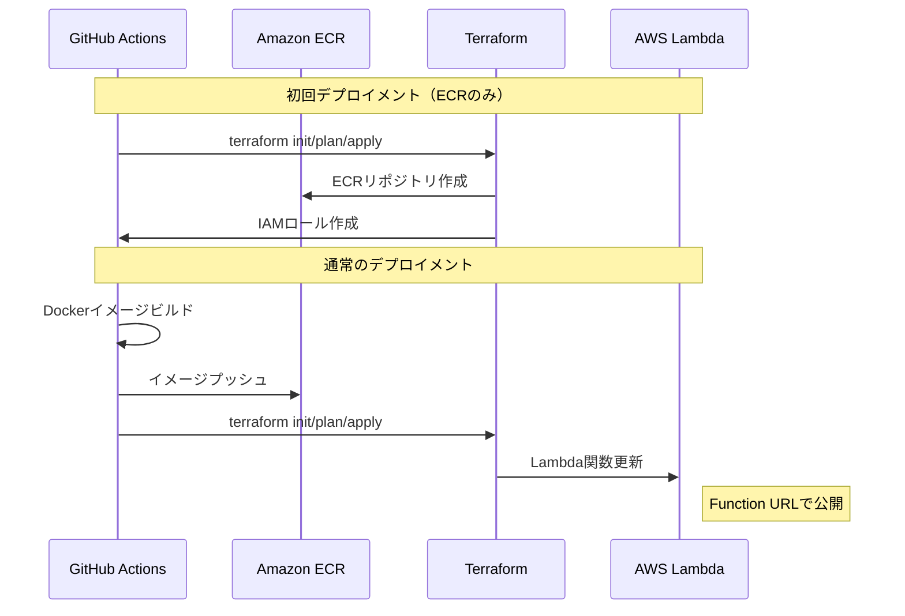

# ResQ - LLMを使ったメール返信アシスタント

ResQは、OpenAIのLLMを活用してメールの返信を支援するシステムです。メールの内容を分析し、返信のための質問生成や、実際の返信文の生成を行うことができます。

## 特徴

- 💬 **インタラクティブな質問生成**: メールの内容を理解し、返信に必要な情報を引き出すための質問を生成
- ✍️ **コンテキストを考慮した返信生成**: メールの文脈、ユーザー情報、選択された返答を考慮した適切な返信を生成
- 🚀 **ストリーミングレスポンス**: 生成された内容をリアルタイムでクライアントに送信

## プロジェクト構成

本プロジェクトはDockerを使用した開発環境を提供しています。開発環境では、docker composeによって以下の2つのサービスがマイクロサービスとして管理されます：

- `applications/backend`: LLMを活用したメール返信支援のバックエンドサービス
- `applications/chrome-extension`: Chrome拡張機能として動作するアプリケーション

各サービスの詳細については、`docs/`内にある各サービスのドキュメントを参照してください。

### フォルダ構成

```
ResQ/
├── .github/                   # GitHub関連
│   ├── ci.yaml                # コードチェックを行うワークフロー定義
│   ├── deploy.yaml            # アプリケーションのデプロイを行うワークフロー定義
│   ├── terraform-ecr.yml      # Terraformによる Amazon ECR のプロビジョニングを行うワークフロー定義 (Reusable Workflows)
│   └── terraform-complete.yml # Terraformによる Amazon ECR と AWS lambda のプロビジョニングを行うワークフロー定義 (Reusable Workflows)
├── applications/              # アプリケーションの実装
│   ├── backend/               # バックエンド実装（詳しくは docs/backend.md を参照）
│   └── chrome-extension/      # 拡張機能のフロントエンド実装
├── docs/                      # ドキュメント関連
├── environments/              # Docker関連
│   ├── ci/                    # CI用のcompose定義
│   ├── deploy/                # デプロイ用のcompose定義
│   ├── dev/                   # 開発用のcompose定義
│   ├── Dockerfile.backend     # バックエンド用のDockerfile
│   ├── Dockerfile.chrome      # Chrome拡張用のDockerfile
│   └── Dockerfile.deploy      # デプロイ用のDockerfile
├── terraform/                 # インフラ定義
│   ├── modules/               # Terraformモジュール
│   │   ├── ecr/               # ECRリポジトリとIAMロール定義
│   │   └── lambda/            # Lambda関数とその関連リソース定義
│   ├── provider.tf            # AWSプロバイダー設定
│   ├── variables.tf           # 変数定義
│   └── main.tf                # モジュールの使用定義
└── README.md
```

## 開発環境のセットアップ

以下の手順で開発環境を構築できます：

1. 必要なツールのインストール
   - Docker [リンク](https://docs.docker.com/engine/install/)
   - Docker Compose [リンク](https://docs.docker.com/compose/install/)

2. 環境変数の設定
   ```bash
   # 開発環境の環境変数ファイルを作成
   cp environments/backend.env.sample environments/backend.env
   ```

   作成された`backend.env`に必要な環境変数を指定する

> [!Note]
> `OPENAI_API_KEY`には、OpenAIの[ダッシュボード](https://platform.openai.com/api-keys)で発行できるAPIキーを指定して下さい。
> `CORS_ALLOW_ORIGINS`には、バックエンドへの接続を許容するオリジンを記入してください。

3. コンテナの起動
   ```bash
   # 開発環境のコンテナを起動
   cd environments/dev
   docker compose up -d
   ```

4. コンテナにアクセス
   - バックエンド
       ```bash
       # environments/dev下で実行
       docker compose exec backend bash
       ```

   - Chrome拡張アプリケーション
       ```bash
       # environments/dev下で実行
       docker compose exec chrome-extension bash
       ```

起動したコンテナに入った後のセットアップ手順については、それぞれの`docs`内にある各サービスのドキュメントを参照してください。

## アプリケーションバックエンドのデプロイ

本プロジェクトでは、GitHub Actions と [Terraform](https://developer.hashicorp.com/terraform) を使用して AWS Lambda への自動デプロイを行っています。プロジェクトで公開しているバックエンドサーバーを利用いただく場合には特に気にする必要はありませんが、ご自身で本アプリケーションを改良し、セルフホストしたい場合には以下の手順を参考にしてください。

### 前提条件

1. AWS 関連の準備

   本プロジェクトでは、デプロイ先のクラウドプロバイダーとして [AWS](https://aws.amazon.com/jp/?nc2=h_lg) に対応しています。AWSのアカウントを所持されていない方は、まずアカウントを作成してください。
   アプリケーションで使用するサービスは [Amazon Elastic Container Registry(ECR)](https://aws.amazon.com/jp/ecr/) と　[AWS Lambda](https://aws.amazon.com/jp/lambda/) です。いずれのサービスも無料枠の範囲内であれば課金されることはありませんが、詳細はご自身でよく確認の上で利用してください。

   - [AWS Lambdaの料金](https://aws.amazon.com/jp/lambda/pricing/)
   - [Amazon ECRの料金](https://aws.amazon.com/jp/ecr/pricing/)

> [!Important]
> 本ドキュメントの手順に従ってデプロイを実行した結果、予期しない課金が発生した場合でも、当方は一切の責任を負いかねますので、あらかじめご了承ください。

   デプロイ先のリージョンは、デフォルトで `ap-northeast-1` に設定されているため、変更したい方は `terraform/provider.tf` と `.github/workflows/deploy.yml`の該当箇所を変更してください。

2. GitHub リポジトリの Secrets 設定

   本リポジトリを自分のGitHubアカウントに複製して、以下の Secrets を設定してください：

   ```yaml
   # 共通のSecrets（[Repository Secrets](https://docs.github.com/ja/actions/security-for-github-actions/security-guides/using-secrets-in-github-actions#using-secrets-in-a-workflow) として設定）
   AWS_ACCOUNT_ID: "123456789012"  # AWSアカウントID
   ALLOWED_ORIGINS: "chrome-extension://<EXTENSION_ID>, https://other.example.com, ..." # カンマで区切られたオリジン
   PROJECT_NAME: "Project-Name" # プロジェクト名（AWSのリソースの識別子として使用されます）

   # 環境別の Secrets ([Environment secrets](https://docs.github.com/ja/actions/security-for-github-actions/security-guides/using-secrets-in-github-actions#example-using-bash) として設定)
   ## Development 環境
   LAMBDA_MEMORY: "512"
   LAMBDA_TIMEOUT: "30"

   ## Production 環境
   LAMBDA_MEMORY: "1024"
   LAMBDA_TIMEOUT: "60"
   ```

3. ブランチ設定

   本番環境と開発環境で異なるリソースをプロビジョニングする設定になっているため、以下の二つのブランチを作成してください

   - `develop` ブランチ: 開発環境へのデプロイに使用
   - `release` ブランチ: 本番環境へのデプロイに使用

### デプロイの実行

デプロイは GitHub Actions の "Deploy Application" ワークフローから実行できます：

1. 初回デプロイメント時
   - GitHub Actions の "Deploy Application" ワークフローから"Run Workflows"を選択
   - 環境（dev/prod）を選択
   - Stage: "ecr-only" を選択して実行
   - これにより、ECRリポジトリとIAMロールが作成されます

2. 2回目以降のデプロイメント
   - GitHub Actions の "Deploy Application" ワークフローから"Run Workflows"を選択
   - 環境（dev/prod）を選択
   - Stage: "complete"（デフォルト）を選択して実行
   - これにより、Dockerイメージのビルド・プッシュとLambda関数の更新が行われます

### デプロイの流れ



デプロイが完了すると：
- Lambda Function URL が出力されます
- CloudWatch Logs でログを確認できます
