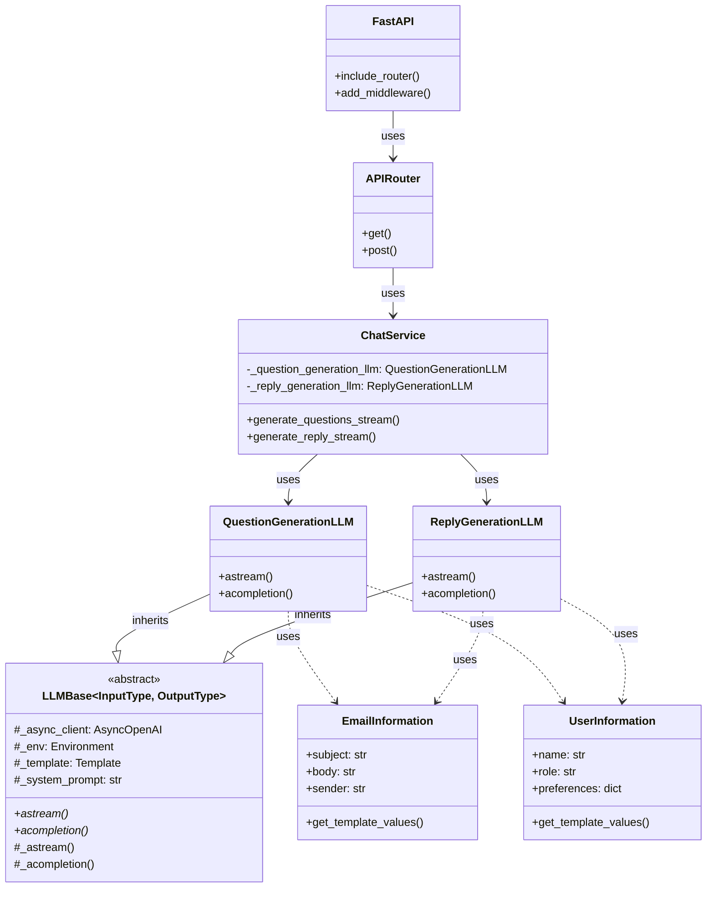
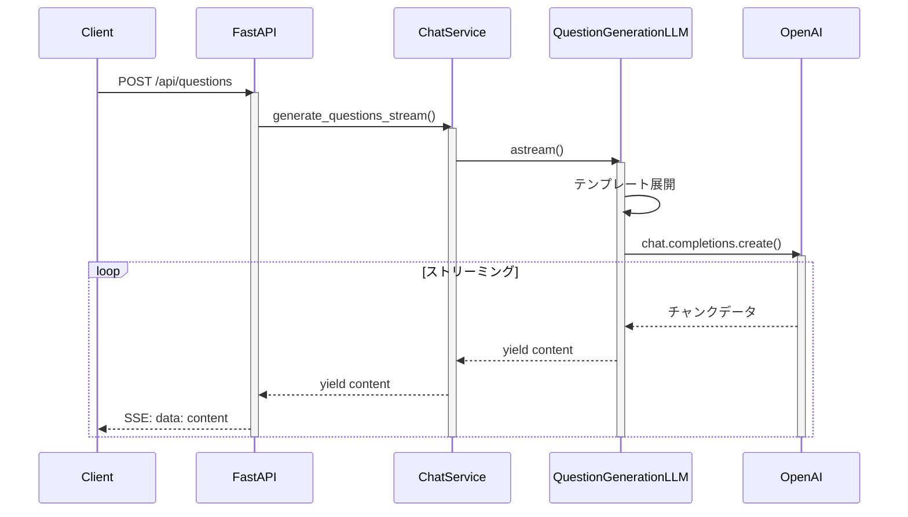
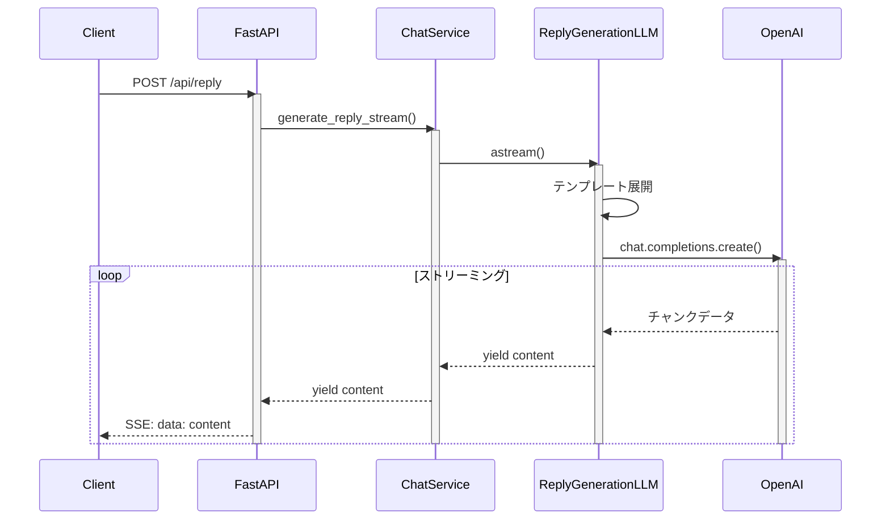

# バックエンドサービス

## セットアップ

> [!Note]
> 本プロジェクトのDockerを使用した開発環境のセットアップについては、プロジェクトトップの`README.md`を参照してください。

1. 仮想環境の作成とパッケージのインストール

    コンテナ内で以下のコマンドを実行してください：

    ```bash
    uv sync
    ```

2. 開発サーバーの起動

    ```bash
    poe run-backend-dev
    ```

    これで http://localhost:8000 でサーバーが起動します。

3. APIエンドポイントの利用

    http://localhost:8000/docs にアクセスすることで、Swagger UIから実際のエンドポイントの挙動を確認できます。

    

## 開発ガイド

### フォルダ構成

```
src/
├── api/           # API層：HTTPインターフェース
│   ├── routes.py  # エンドポイント定義
│   └── schemas.py # リクエスト/レスポンススキーマ
├── domain/        # ドメイン層：ビジネスロジック
│   ├── models/    # ドメインモデル
│   └── services/  # ビジネスロジック実装
│       └── llm/   # LLM関連の実装
└── main.py        # アプリケーションのエントリーポイント
```

### 主要コンポーネント

- **ChatService**: LLMとの対話を管理する中核サービス
- **LLMBase**: OpenAI APIとの通信を抽象化した基底クラス
- **QuestionGenerationLLM/ReplyGenerationLLM**: 具体的なLLM機能の実装

ユーザーの会話内容の永続化や分析を追加する場合には、`ChatService`に対応するロジックを実装してください。

### APIエンドポイント

- `GET /api/health`: ヘルスチェック
- `POST /api/questions`: メール内容に基づく質問の生成（SSE Streaming）
- `POST /api/reply`: メールへの返信文の生成（SSE Streaming）


### 開発用コマンド

poethepoetを使用して以下のタスクを実行できます：

```bash
# 開発サーバーの起動
poe run-backend-dev

# コードフォーマット
poe format

# リンター実行
poe lint

# テスト実行
poe test

# 全チェック実行
poe test-all
```

コード品質管理には以下のツールを利用しています。

- **ruff**: リンティングとフォーマッティング
- **mypy**: 静的型チェック
- **pytest**: テスティング
- **mdformat**: Markdownフォーマッティング

## FAQ

### Q: エンドポイントのストリーミングレスポンスの詳細が知りたいです

A: 質問生成と応答生成のエンドポイントでは、クライアントからのPOSTリクエストに対する応答として[Server-sent-event](https://developer.mozilla.org/en-US/docs/Web/API/Server-sent_events/Using_server-sent_events)を使ったストリーミングレスポンスを実装しています。

各イベントの形式の定義は[こちら](https://developer.mozilla.org/en-US/docs/Web/API/Server-sent_events/Using_server-sent_events#event_stream_format)を、クライアント側のイベント処理の手順については[こちら](https://html.spec.whatwg.org/multipage/server-sent-events.html#event-stream-interpretation)を参考にしてください。

### Q: システムプロンプトやテンプレートはどこで管理されていますか？

A: `data/`ディレクトリ配下で管理されています：
- `system_prompts/`: LLMのシステムプロンプト
- `templates/`: プロンプトテンプレート（Jinja2形式）

これらは、各LLMサービスの具象クラス（`QuestionGenerationLLM`, `ReplyGenerationLLM`）のコンストラクタ（`__init__`）で読み込まれています。

プロンプトテンプレートはJinja2形式で記述され、以下のような変数を使用できます：
- メール情報（件名、本文、送信者情報など）
- ユーザー情報（名前、役職、好みなど）
- カスタマイズ設定（トーン、スタイルなど）

### Q: 本番環境での実行方法は？

A: 以下のコマンドで本番用サーバーを起動できます：
```bash
poe run-backend-prod
```
これにより、4つのワーカープロセスで動作するGunicornサーバーが起動します。

現状は特に開発用のサーバーを使用してもらう形で問題ないですが、AWSなどのクラウドサービスにデプロイする際には上記のコマンドを使用してください。

### Q: 新しいLLM機能を追加するにはどうすればよいですか？

A: 以下の手順で実装できます：

1. `src/domain/services/llm/`に新しいLLMクラスを作成
   ```python
   class NewFeatureLLM(LLMBase[InputType, OutputType]):
       def __init__(self, prompt_directory: pathlib.Path) -> None:
           template_path = prompt_directory / "templates" / "new_feature_template.jinja2"
           system_prompt_path = prompt_directory / "system_prompts" / "new_feature_system_prompt.txt"
           super().__init__(template_path, system_prompt_path)
   ```
    > [! Impoertant]
    > `LLMBase`では`astream`や`acompletion`の入出力の型安全性を確保するためジェネリクスを使用しています。従って、継承して具象クラスを定義する際には、適切な型引数（`InputType`, `OutputType`）を指定してください。

2. `LLMBase`を継承し、必要なメソッドを実装
   - `astream`: ストリーミング形式でのレスポンス生成
   - `acompletion`: 一括形式でのレスポンス生成

3. `data/`に必要なプロンプトとテンプレートを追加
   - システムプロンプト: LLMの役割や制約を定義
   - テンプレート: 入力データの構造化フォーマットを定義

4. `ChatService`に（もしくは必要に応じて新たなサービスクラスを作成して）新機能を統合


## システム構成の詳細

### クラス図



### シーケンス図（質問生成フロー）



### シーケンス図（返信生成フロー）

