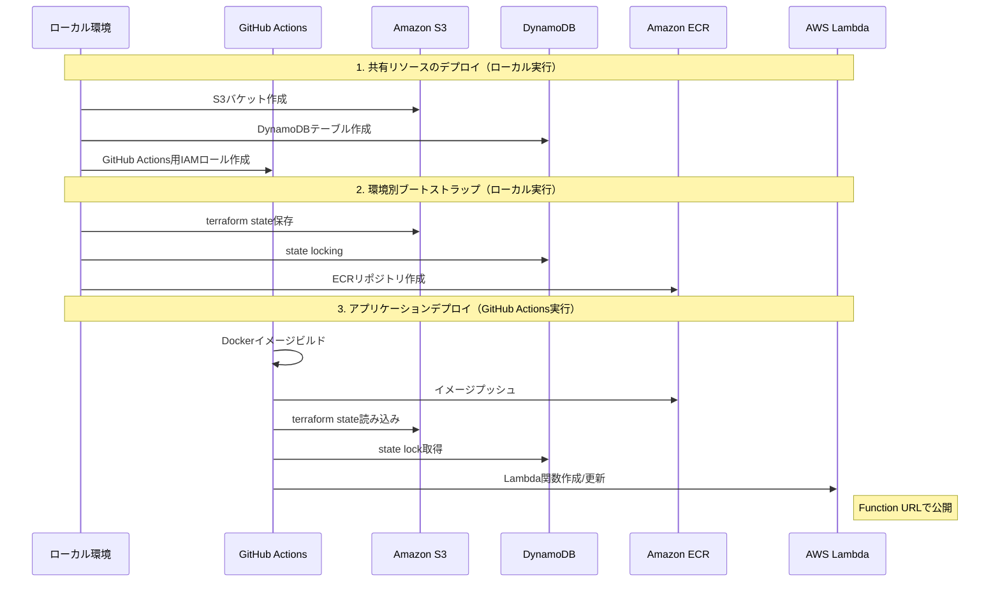
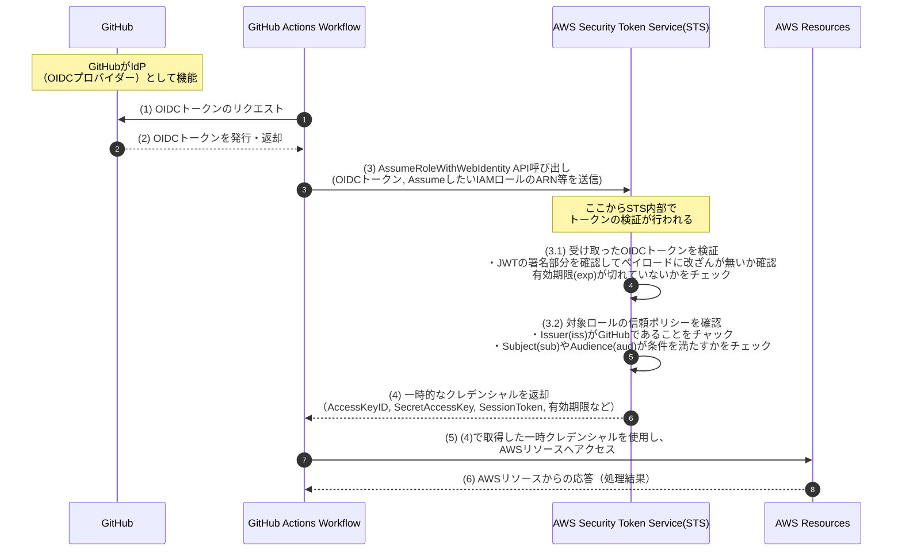

# アプリケーションバックエンドのデプロイ

本プロジェクトでは、GitHub Actions と [Terraform](https://developer.hashicorp.com/terraform) を使用して AWS Lambda への継続的デリバリー(CD)を行っています。プロジェクトで公開しているバックエンドサーバーを利用いただく場合には特に気にする必要はありませんが、ご自身で本アプリケーションを改良し、 AWS 上にセルフホストしたい場合には以下の手順を参考にしてください。

## 事前準備

### 1. AWS 関連の準備

 - アカウントの作成

   本プロジェクトでは、デプロイ先のクラウドプロバイダーとして [AWS](https://aws.amazon.com/jp/?nc2=h_lg) に対応しています。 AWS のアカウントを所持されていない方は、まずアカウントを作成してください。

   アプリケーションで使用するサービスは以下の通りです：
   - [Amazon Elastic Container Registry(ECR)](https://aws.amazon.com/jp/ecr/): AWS Lambda 関数の作成元となる Docker イメージの保存
   - [AWS Lambda](https://aws.amazon.com/jp/lambda/): アプリケーションバックエンドをサーバーレス関数として実行
   - [Amazon S3](https://aws.amazon.com/jp/s3/): Terraform の state 管理
   - [Amazon DynamoDB](https://aws.amazon.com/jp/dynamodb/): Terraform の state locking

  いずれのサービスも無料枠の範囲内であれば課金されることはありませんが、詳細はご自身でよく確認の上で利用してください。

  - [AWS Lambdaの料金](https://aws.amazon.com/jp/lambda/pricing/)
  - [Amazon ECRの料金](https://aws.amazon.com/jp/ecr/pricing/)
  - [Amazon S3の料金](https://aws.amazon.com/jp/s3/pricing/)
  - [Amazon DynamoDBの料金](https://aws.amazon.com/jp/dynamodb/pricing/)

> [!Important]
> 本ドキュメントの手順に従ってデプロイを実行した結果、予期しない課金が発生した場合でも、当方は一切の責任を負いかねますので、あらかじめご了承ください。

 - 環境変数の設定

   ローカル環境や GitHub Actions のワークフロー環境から AWS リソースへのアクセスを許可するために、AWS の認証キーを取得する必要があります。 `environments/terraform.env` に所定の環境変数を指定してください（詳しくは[認証の仕組み](認証の仕組み)の章を参照してください）

   `*.env` ファイルは、セキュリティ上の観点から Git の追跡対象外に指定してあるため、最初に `*.env.sample` をコピーして自身でファイルを作成する必要があります。

   ```bash
   cp environments/terraform.env.sample environments/terraform.env
   ```

   コピーしたファイルに以下の環境変数を指定してください。

   ```Dotenv
   # AWS credentials
   AWS_ACCESS_KEY_ID="<AWS_ACCESS_KEY_ID>"
   AWS_SECRET_ACCESS_KEY="<AWS_SECRET_ACCESS_KEY>"
   AWS_SESSION_TOKEN="<AWS_SESSION_TOKEN>"
   AWS_DEFAULT_REGION="<AWS_DEFAULT_REGION>"
   ```

### 2. GitHub リポジトリの Variables/Secrets 設定

GitHub Actions のワークフロー内で参照している環境変数については、本リポジトリを自身の GitHub アカウントに複製した後に GitHub 上で指定する必要があります。

GitHub にはデプロイ環境を定義・管理する機能として [Environments](https://docs.github.com/ja/actions/managing-workflow-runs-and-deployments/managing-deployments/managing-environments-for-deployment) という機能が提供されており、こちらを使用して必要な環境変数を登録します。リポジトリの "Settings" -> "Environments" から **`dev`** と **`prod`** という二つの環境を作成し、それぞれの環境で以下の環境変数を [Environment secrets](https://docs.github.com/ja/actions/managing-workflow-runs-and-deployments/managing-deployments/managing-environments-for-deployment#environment-secrets), [Environment variables](https://docs.github.com/ja/actions/managing-workflow-runs-and-deployments/managing-deployments/managing-environments-for-deployment#environment-variables) として登録してください

 - Environment secrets として登録する環境変数

   ```yaml
   OPENAI_API_KEY: "sk-xxxxxxxxxxxxxxxxxxxxxxxxxxxxxxxxxxxxxxxxxxxxxxxx" # OpenAI API キー
   ALLOWED_ORIGINS: "["chrome-extension://<EXTENSION_ID>"]" # list(string) 形式で、アクセスを許可するオリジンを指定
   ```

 - Environment variables として登録する環境変数

   ```yaml
   PROJECT_NAME: "Project-Name" # プロジェクト名（AWSのリソースの識別子として使用されます）
   AWS_ACCOUNT_ID: "123456789012"  # AWSアカウントID
   AWS_REGION: "ap-northeast-1" # AWSのリージョン名。必ず 1. で設定した `AWS_DEFAULT_REGION` と同じ値にすること
   LAMBDA_MEMORY: "512" # Lambda 関数のメモリサイズ(MB)
   LAMBDA_TIMEOUT: "30" # Lambda 関数のタイムアウト設定(秒)
   ```

>[!Warning]
> GitHub の Environments 機能は、 Free プランのユーザーは Public リポジトリでないと使用できません。 Free プランの Private リポジトリで利用したい方は、代わりに [Repository secrets](https://docs.github.com/ja/actions/security-for-github-actions/security-guides/using-secrets-in-github-actions#creating-secrets-for-a-repository) と [Repository variables](https://docs.github.com/ja/actions/writing-workflows/choosing-what-your-workflow-does/store-information-in-variables#creating-configuration-variables-for-a-repository) を使用してください。この場合は、ワークフローの入力値として環境の情報が使用できないため `.github/workflows/deploy.yml` の `workflow dispatch.inputs` を適宜修正してください（ input 自体を削除して、`.github/workflows/deploy.yml` ワークフロー内の `inputs.environment` をすべて "prod" でハードコーディングするなどでも良いと思います）

> [!Important]
> Cross Origin Resource Sharing(CORS) は、あるオリジンに設置された API サーバーに対して、別のオリジンからリクエストが送られた際に適用される**ブラウザの**制約です。従って、この設定を適用しても、**ブラウザ経由でアクセスを試みた際には** Chrome Extension からのリクエストのみ許可されるようになるというだけであり、 curl や Postman などを使用すれば、任意のIPアドレスからリクエストを送ることができることに注意してください。
> 本プロジェクトでは、バックエンドに認証機能を追加した際にセキュリティ対策として必要となるため、CORS の設定を最初から含めています。

### 3. ブランチ設定

一般的なアプリケーションのデプロイでは、本番環境と開発環境で異なるブランチを使用します。例えば、以下の二つのブランチを作成して下さい：

- `develop` ブランチ: 開発環境へのデプロイに使用
- `release` ブランチ: 本番環境へのデプロイに使用

また、上記以外のブランチ名を採用した場合は、 `.github/workflows/terraform-reusable.yml` の最後のステップで条件分岐に使用されるブランチ名を書き換えてください

```yaml
...
- name: Terraform Apply
   working-directory: ${{ env.DOCKER_COMPOSE_DIRECTORY }}
   if: github.ref == 'refs/heads/develop' || github.ref == 'refs/heads/release' # <--- ここのブランチ名を2つ変更する
   run: docker compose exec -T terraform terraform -chdir=environments apply -auto-approve tfplan
...
```

> [!Important]
> 2. 3. で Environments と対応するブランチを作成しただけでは、`develop` ブランチの内容を `prod` 環境にデプロイすることも可能です。そのため、[デプロイ保護規則](https://docs.github.com/ja/actions/managing-workflow-runs-and-deployments/managing-deployments/managing-environments-for-deployment#deployment-protection-rules)を設定し、環境ごとにデプロイ可能なブランチを制限したり、デプロイ時にレビュアーの承認を必須にすることを強く推奨します

### 4. Terraform 関連の設定

- `*.tfvars` ファイルの設定

   本プロジェクトでは、一部の Terraform によるリソースプロビジョニングの実行時に、外部から指定した変数を使用しています。この変数は `*.tfvars` ファイルによって管理されており、 terraform コマンドを実行する前に所定の変数を記載しておく必要があります。なお、 `*.tfvars` ファイルはセキュリティ上の観点から Git の追跡対象外に指定してあるため、最初に `*.tfvars.sample` をコピーして自身でファイルを作成する必要があります。

   - `terraform/bootstrap/shared/terraform.tfvars`

      ファイルの作成
      ```bash
      cp terraform/bootstrap/shared/terraform.tfvars.sample terraform/bootstrap/shared/terraform.tfvars
      ```

      変数の記入
      ```terraform
      project_name      = "Project-Name" # プロジェクト名。必ず 2. で設定した `PROJECT_NAME` と同じ値にすること
      github_repository = "OwnerName/RepositoryName" # リポジトリのオーナーとリポジトリ名をつなげた値
      ```

   - `terraform/bootstrap/dev/terraform.tfvars`

      ファイルの作成
      ```bash
      cp terraform/bootstrap/dev/terraform.tfvars.sample terraform/bootstrap/dev/terraform.tfvars
      ```

      変数の記入
      ```terraform
      project_name = "Project-Name" # プロジェクト名。必ず 2. で設定した `PROJECT_NAME` と同じ値にすること
      ```

   - `terraform/bootstrap/prod/terraform.tfvars`

      ファイルの作成
      ```bash
      cp terraform/bootstrap/prod/terraform.tfvars.sample terraform/bootstrap/prod/terraform.tfvars
      ```

      変数の記入
      ```terraform
      project_name = "Project-Name" # プロジェクト名。必ず 2. で設定した `PROJECT_NAME` と同じ値にすること
      ```

- `backend.hcl` ファイルの設定

   terraform では、実際にどのようなリソースが建てられているのかを記録するために、state ファイル（`*.tfstate`）を使用します。このファイルには、terraformによって管理されているすべてのリソースの状態（例：リソースの識別子、属性、依存関係など）が記録されています。複数人で開発を行う場合には、それぞれの開発環境からリソースの作成・更新・削除があった場合にも統一的なリソースの状態管理ができるように、 state ファイルをクラウド上（今回の場合は S3 ）で管理することが推奨されます。
   また、複数の開発者が同時に terraform コマンドを実行した場合、state ファイルの競合やリソースの不整合が発生する可能性があるため terraform には state lockingという機能が提供されています。この state ファイルの lock 状況も、通常はクラウド上（今回の場合は DynamoDB ）で管理を行います。

   そして、state ファイルとその lock 状態の管理場所を設定しているのが `backend.hcl` ファイルであるため、事前に設定が必要です。

   - `terraform/bootstrap/dev/backend.hcl`

      ```hcl
      bucket         = "<PROJECT_NAME>-terraform-state"      # stateファイルを保存するS3バケット名
      key            = "bootstrap/dev/terraform.tfstate"     # stateファイルをS3に保存する際のキー名
      region         = "<AWS_REGION>"                        # S3バケットのリージョン
      dynamodb_table = "<PROJECT_NAME>-terraform-state-lock" # state lockingに使用するDynamoDBテーブル名
      encrypt        = true                                  # stateファイルの暗号化の有効化
      ```

      - `terraform/bootstrap/prod/backend.hcl`

      ```hcl
      bucket         = "<PROJECT_NAME>-terraform-state"      # stateファイルを保存するS3バケット名
      key            = "bootstrap/prod/terraform.tfstate"     # stateファイルをS3に保存する際のキー名
      region         = "<AWS_REGION>"                        # S3バケットのリージョン
      dynamodb_table = "<PROJECT_NAME>-terraform-state-lock" # state lockingに使用するDynamoDBテーブル名
      encrypt        = true                                  # stateファイルの暗号化の有効化
      ```

   - `terraform/environments/backend-dev.hcl`

      ```hcl
      bucket         = "<PROJECT_NAME>-terraform-state"      # stateファイルを保存するS3バケット名
      key            = "environments/dev/terraform.tfstate"  # stateファイルをS3に保存する際のキー名
      region         = "<AWS_REGION>"                        # S3バケットのリージョン
      dynamodb_table = "<PROJECT_NAME>-terraform-state-lock" # state lockingに使用するDynamoDBテーブル名
      encrypt        = true                                  # stateファイルの暗号化の有効化
      ```

   - `terraform/environments/backend-prod.hcl`

      ```hcl
      bucket         = "<PROJECT_NAME>-terraform-state"      # stateファイルを保存するS3バケット名
      key            = "environments/prod/terraform.tfstate"  # stateファイルをS3に保存する際のキー名
      region         = "<AWS_REGION>"                        # S3バケットのリージョン
      dynamodb_table = "<PROJECT_NAME>-terraform-state-lock" # state lockingに使用するDynamoDBテーブル名
      encrypt        = true                                  # stateファイルの暗号化の有効化
      ```


## デプロイの手順

本プロジェクトの Terraform によるリソースプロビジョニングは、大まかには以下の3段階で構成されています：

1. 共有リソース（terraform/bootstrap/shared/）のプロビジョニング
   - 目的：Terraform の状態管理用リソースの用意と GitHub Actions で使用する認証基盤の構築
   - 作成されるリソース：
     * S3バケット（terraform state保存用）
     * DynamoDBテーブル（state locking用）
     * GitHub Actions用のIAMロールと付随するIAMポリシー（OIDC認証用）
   - デプロイ方法：ローカルで実行（`terraform init` → `terraform apply`）
   - tfstateの管理：ローカルで管理

2. 環境別の事前準備（terraform/bootstrap/{dev,prod}/）
   - 目的：各環境(dev/prod)で使用するECRリポジトリの準備
   - 作成されるリソース：
     * ECRリポジトリ（Lambda関数デプロイに使用するDockerイメージ保存用）
   - デプロイ方法：ローカルで実行（`terraform init -backend-config=backend.hcl` → `terraform apply`）
   - tfstateの管理：1で作成したS3バケットとDynamoDBで管理

3. アプリケーションリソース（terraform/environments/）のプロビジョニング
   - 目的：Lambda関数のデプロイと関数URLの発行・設定
   - 作成されるリソース：
     * Lambda関数（関数URL付き）
     * Lambda実行用IAMロール
   - デプロイ方法：GitHub Actionsで自動実行（`.github/workflows/terraform-reusable.yml`で実行）
   - tfstateの管理：1で作成したS3バケットとDynamoDBで管理

### 1. 共有リソースのプロビジョニング

```bash
cd terraform/bootstrap/shared

terraform init
terraform apply
```

このステップで作成される GitHub Actions 用のIAMロールには以下の権限が付与されます：
- IAMロールの作成・管理（Lambda 実行用）
- ECRリポジトリへのアクセス（ Docker イメージのプッシュ・プル）
- Lambda 関数の管理（作成・更新・削除）
- S3バケットへのアクセス（ terraform の state 管理用）
- DynamoDB テーブルへのアクセス（ state locking 用）

### ２. 環境別の事前準備

```bash
cd terraform/bootstrap/dev # 開発環境へのデプロイ
cd terraform/bootstrap/prod # 本番環境へのデプロイ

terraform init -backend-config=backend.hcl
terraform apply
```

### ３. アプリケーションリソースのプロビジョニング

GitHub のリポジトリページを開き、"Actions" を開きます。左側にリポジトリで使用可能なワークフローの一覧が並んでいるので、"deploy-applications" を選択します。画面上の "Run workflow" ボタンから**デプロイする対象のブランチ(develop/release)**と**デプロイ先の環境(dev/prod)**を選択して実行すれば、アプリケーションリソースがデプロイされます。

以下に、デプロイ全体のフローのシーケンス図を載せておきます。



## （補足）認証の仕組み

### ローカルでのterraform実行時

本リポジトリでは GitHub Actions のワークフロー上で terraform コマンドを実行することで、アプリケーションの継続的デリバリー(CD)を行っています。
この機能が正しく動作するためには、事前にAWS上にいくつか用意する必要のあるリソースがありますが、本プロジェクトではこれらも terraform によって管理しています。具体的には以下の３つです。

     - S3バケット（terraform state保存用）
     - DynamoDBテーブル（state locking用）
     - GitHub Actions用のIAMロール（OIDC認証）

従って初めてアプリケーションをデプロイする際には、一度だけローカルで terraform コマンドを実行して必要なAWSリソースをプロビジョニングする必要があります。
このためのリソース定義は `terraform/bootstrap/{shared, dev, prod}/main.tf` ファイルに記載されていますが、AWSをクラウドプロバイダーとして利用するためには、リソースをプロビジョニングしたい対象のAWSアカウントで terraform による操作を許可する操作（認証）が必須となります。

```terraform
terraform {
  required_version = "1.10.4"

  # 必要なプロバイダーの種類とバージョンを指定
  required_providers {
    aws = {
      source  = "hashicorp/aws"
      version = "5.90.0"
    }
  }
}

# AWSプロバイダーの設定（内部敵に `AWS_ACCESS_KEY_ID` や `AWS_SECRET_ACCESS_KEY` などを読み込み）
provider "aws" {}
...
```

terraform のAWSプロバイダーを認証する方法はいくつかありますが、本リポジトリでは[特定の環境変数を設定することで認証](https://registry.terraform.io/providers/hashicorp/aws/latest/docs#environment-variables)を行っています。具体的には以下の３つの環境変数を `environments/terraform.env` に指定しており、これを `environments/dev/docker-compose.yaml` で参照することで `terraform` サービスのDockerコンテナ内で環境変数を使用可能にしています。

 - `AWS_ACCESS_KEY_ID`
 - `AWS_SECRET_ACCESS_KEY`
 - `AWS_SESSION_TOKEN`（オプション。一時クレデンシャルを使用する際には指定必須）

> [!Note]
> `environments/terraform.env` にはもう一つ `AWS_DEFAULT_REGION` という環境変数が記載されていますが、これはリソースをプロビジョニングするリージョンの指定のために使用されています。AWSプロバイダーを使用している際には、[AWSのリージョン情報が terraform の Data Source として取得可能になる](https://registry.terraform.io/providers/hashicorp/aws/latest/docs/data-sources/region)ため、外部から明示的に与えています。

上記の認証キーを取得する方法はいくつかあります。しかし、[AWS公式のガイドライン](https://docs.aws.amazon.com/ja_jp/IAM/latest/UserGuide/security-creds.html)では有効期限付きの一時クレデンシャルを使用することを推奨しているため、可能であれば有効期限の無い静的クレデンシャルであるアクセスキーの発行による認証ではなく、一時クレデンシャルによる認証を行うことを検討してください。

ここでは趣旨とずれるため認証キーの具体的な取得方法については記載しませんが、参考になる記事のリンクを掲載しておきます。

- 静的クレデンシャル

   - [【AWS】aws cliの設定方法 - アクセスキーの発行](https://zenn.dev/akkie1030/articles/aws-cli-setup-tutorial#%E3%82%A2%E3%82%AF%E3%82%BB%E3%82%B9%E3%82%AD%E3%83%BC%E3%81%AE%E7%99%BA%E8%A1%8C)

- 一時クレデンシャル

   - [アクセスキーを使わずに、AWS CLIを利用する](https://qiita.com/Uminchu618/items/8e2791ed72a107f59cec)
      - 最小権限のIAMユーザーから必要な権限を持つIAMロールをAssumeRoleするやり方です
   - [アクセスキーを使ったaws-cliはもうやめよう！](https://qiita.com/s_moriyama/items/14b703cc0dfa91a6f464)
      - IAM Identity Centerを使うやり方です

### GitHub Actions ワークフロー実行時

GitHub Actionsのワークフロー上で terraform コマンドを実行する場合は、 GitHub Actions のワークフローの実行環境で terraform によるリソースプロビジョニングを認証する必要があります。この場合も、最も簡単な方法として有効期間の長いアクセスキーを GitHub Secret に記載して使用する方法が考えられますが、前述の通り有効期間の長い認証キーを使用するのはセキュリティ上のリスクがあります。従って本プロジェクトでは、複数サービス間でアイデンティティ連携を可能にするプロトコルであるOpenAI Connect(OIDC)を使用して、一時クレデンシャルによる認証を行っています。この方法は[GitHubの公式ドキュメント](https://docs.github.com/ja/enterprise-cloud@latest/actions/security-for-github-actions/security-hardening-your-deployments/configuring-openid-connect-in-amazon-web-services)にも記載があり、一般的に GitHub Actions のワークフロー内でクラウドプロバイダーと連携する際のベストプラクティスとして知られています。

OIDCを使った認証では、以下のような手順で AWS 側が一時クレデンシャルを発行します。

1. AWS側で GitHub Actions 上で使用する予定のIAMロールを作成する。今回の場合は、ローカルでの terraform 実行(`terraform/bootstrap/shared`)によって実行済み

2. 1.で作成したIAMロールに対して、信頼できる連携先のIdentity Provider(今回の場合はGitHub)の情報を信頼ポリシーとしてアタッチしておく。今回の場合は、ローカルでの terraform 実行(`terraform/bootstrap/shared`)によって実行済み

   ```terraform
   # 対応するリソース定義 @terraform/modules/gha-iam/main.tf

   # 連携先のIdentity Providerの情報（今回はGitHub）
   resource "aws_iam_openid_connect_provider" "github_actions" {
      url             = "https://token.actions.githubusercontent.com"
      client_id_list  = ["sts.amazonaws.com"]
      thumbprint_list = ["6938fd4d98bab03faadb97b34396831e3780aea1"]
   }

   # GitHub Actions 上で使用するIAMロール
   resource "aws_iam_role" "github_actions" {
      name = "${var.project_name}-github-actions-role"

      # Identity Providerを信頼するポリシー
      assume_role_policy = jsonencode({
         Version = "2012-10-17"
         Statement = [
            {
               Action = "sts:AssumeRoleWithWebIdentity"
               Effect = "Allow"
               Principal = {
                  Federated = aws_iam_openid_connect_provider.github_actions.arn
               }
               Condition = {
                  StringLike = {
                     "token.actions.githubusercontent.com:sub" : "repo:${var.github_repository}:*"
                  }
                  StringEquals = {
                     "token.actions.githubusercontent.com:aud" : "sts.amazonaws.com"
                  }
               }
            }
         ]
      })

      ...
   }
   ```

3. GitHub Actions のワークフロー上から Identity Provider である GitHub にOIDCトークンの発行を依頼
4. 発行されたOIDCトークンとともにワークフロー上で一時的に使用したいIAMロール（1.で作成したIAMロール）を指定してAWSにリクエストを送り、対象ロールを使用するための一時クレデンシャルの発行を依頼

   ```yaml
   # 対応するワークフロー定義 @.github/workflows/deploy.yml
   ...
   - name: Configure AWS credentials
      id: credentials
      uses: aws-actions/configure-aws-credentials@v4
      with:
         role-to-assume: arn:aws:iam::${{ vars.AWS_ACCOUNT_ID }}:role/${{ vars.PROJECT_NAME }}-github-actions-role
         role-session-name: ${{ env.SESSION_NAME }}
         aws-region: ${{ env.AWS_REGION }}
         output-credentials: true
   ...
   ```

5. 得られた一時クレデンシャルを使って terraform コマンドを実行

   ```yaml
   # 対応するワークフロー定義 @.github/workflows/terraform-reusable.yml
   ...
   - name: Boot up terraform container
      run: |
         AWS_ACCESS_KEY_ID=${{ steps.credentials.outputs.aws-access-key-id }} \
         AWS_SECRET_ACCESS_KEY=${{ steps.credentials.outputs.aws-secret-access-key }} \
         AWS_SESSION_TOKEN=${{ steps.credentials.outputs.aws-session-token }} \
         AWS_DEFAULT_REGION=${{ env.AWS_REGION }} \
         docker compose up terraform -d
      working-directory: ${{ env.DOCKER_COMPOSE_DIRECTORY }}
   ...
   - name: Terraform Apply
      working-directory: ${{ env.DOCKER_COMPOSE_DIRECTORY }}
      if: github.ref == 'refs/heads/develop' || github.ref == 'refs/heads/release'
      run: docker compose exec -T terraform terraform -chdir=environments apply -auto-approve tfplan
   ```

以下に GitHub Actions ワークフローにおける、 OIDC を使った AWS の認証フローのシーケンス図を載せておきます。

