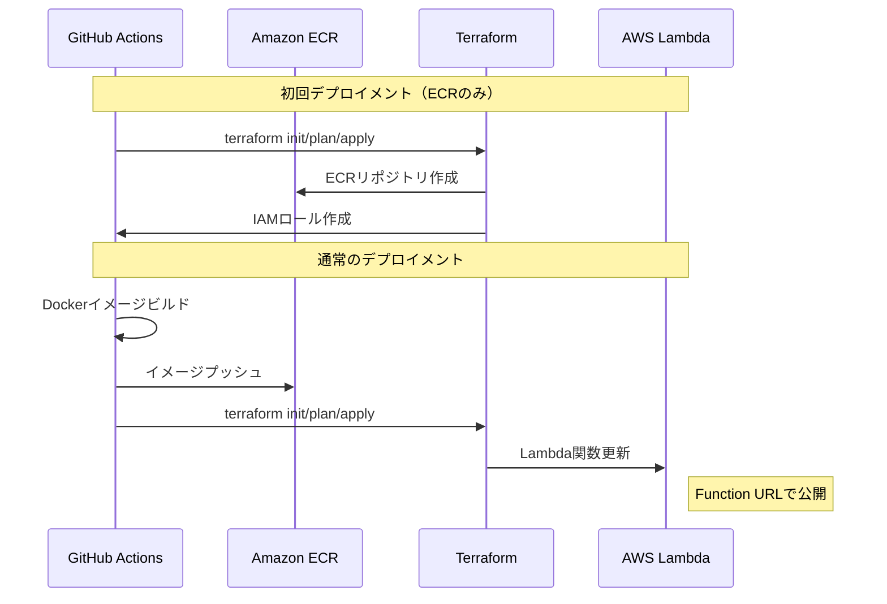

## アプリケーションバックエンドのデプロイ

本プロジェクトでは、GitHub Actions と [Terraform](https://developer.hashicorp.com/terraform) を使用して AWS Lambda への自動デプロイを行っています。プロジェクトで公開しているバックエンドサーバーを利用いただく場合には特に気にする必要はありませんが、ご自身で本アプリケーションを改良し、セルフホストしたい場合には以下の手順を参考にしてください。

### 前提条件

1. AWS 関連の準備

   本プロジェクトでは、デプロイ先のクラウドプロバイダーとして [AWS](https://aws.amazon.com/jp/?nc2=h_lg) に対応しています。AWSのアカウントを所持されていない方は、まずアカウントを作成してください。
   アプリケーションで使用するサービスは [Amazon Elastic Container Registry(ECR)](https://aws.amazon.com/jp/ecr/) と　[AWS Lambda](https://aws.amazon.com/jp/lambda/) です。いずれのサービスも無料枠の範囲内であれば課金されることはありませんが、詳細はご自身でよく確認の上で利用してください。

   - [AWS Lambdaの料金](https://aws.amazon.com/jp/lambda/pricing/)
   - [Amazon ECRの料金](https://aws.amazon.com/jp/ecr/pricing/)

> [!Important]
> 本ドキュメントの手順に従ってデプロイを実行した結果、予期しない課金が発生した場合でも、当方は一切の責任を負いかねますので、あらかじめご了承ください。

   デプロイ先のリージョンは、デフォルトで `ap-northeast-1` に設定されているため、変更したい方は `terraform/provider.tf` と `.github/workflows/deploy.yml`の該当箇所を変更してください。

2. GitHub リポジトリの Secrets 設定

   本リポジトリを自分のGitHubアカウントに複製して、以下の Secrets を設定してください：

   ```yaml
   # 共通のSecrets（[Repository Secrets](https://docs.github.com/ja/actions/security-for-github-actions/security-guides/using-secrets-in-github-actions#using-secrets-in-a-workflow) として設定）
   AWS_ACCOUNT_ID: "123456789012"  # AWSアカウントID
   ALLOWED_ORIGINS: "chrome-extension://<EXTENSION_ID>, https://other.example.com, ..." # カンマで区切られたオリジン
   PROJECT_NAME: "Project-Name" # プロジェクト名（AWSのリソースの識別子として使用されます）

   # 環境別の Secrets ([Environment secrets](https://docs.github.com/ja/actions/security-for-github-actions/security-guides/using-secrets-in-github-actions#example-using-bash) として設定)
   ## Development 環境
   LAMBDA_MEMORY: "512"
   LAMBDA_TIMEOUT: "30"

   ## Production 環境
   LAMBDA_MEMORY: "1024"
   LAMBDA_TIMEOUT: "60"
   ```

3. ブランチ設定

   本番環境と開発環境で異なるリソースをプロビジョニングする設定になっているため、以下の二つのブランチを作成してください

   - `develop` ブランチ: 開発環境へのデプロイに使用
   - `release` ブランチ: 本番環境へのデプロイに使用

### デプロイの実行

デプロイは GitHub Actions の "Deploy Application" ワークフローから実行できます：

1. 初回デプロイメント時
   - GitHub Actions の "Deploy Application" ワークフローから"Run Workflows"を選択
   - 環境（dev/prod）を選択
   - Stage: "ecr-only" を選択して実行
   - これにより、ECRリポジトリとIAMロールが作成されます

2. 2回目以降のデプロイメント
   - GitHub Actions の "Deploy Application" ワークフローから"Run Workflows"を選択
   - 環境（dev/prod）を選択
   - Stage: "complete"（デフォルト）を選択して実行
   - これにより、Dockerイメージのビルド・プッシュとLambda関数の更新が行われます

### デプロイの流れ



デプロイが完了すると：
- Lambda Function URL が出力されます
- CloudWatch Logs でログを確認できます
